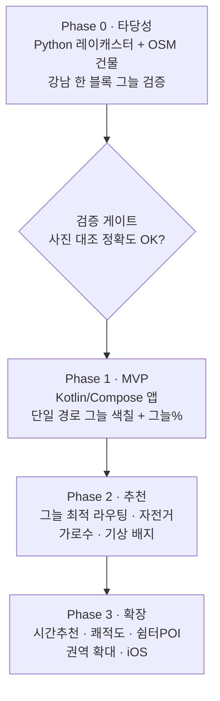
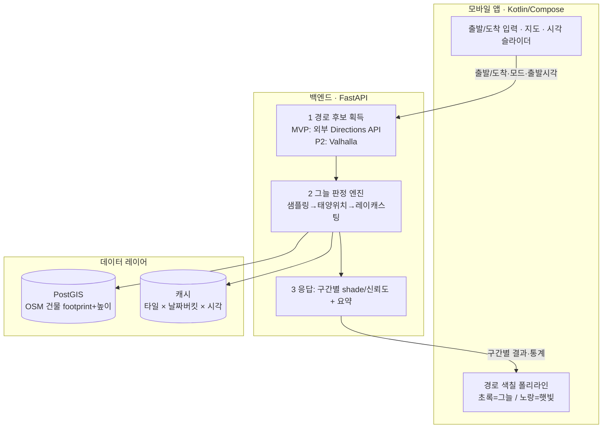

# DEV PLAN — Shelter (가칭 「그늘로」)

> [PRD.md](./PRD.md)를 바탕으로, **무엇을 어떤 순서로 어떻게 만들지**를 실행 가능한 단위로 정리한 개발 로드맵.
> PRD가 *왜·무엇을(Why/What)*이라면, 이 문서는 *어떻게·언제(How/When)*를 다룬다.

문서 버전: v0.1
작성일: 2026-06-05
대응 PRD: v0.2

---

## 0. 개요 & 확정 결정 요약

이 문서는 PRD의 Phase 0~3 로드맵을 작업·기술스택·마일스톤·검증 기준으로 구체화한다. PRD는 상위 기획 문서로 보존하고 수정하지 않는다.

### 확정 결정

| 항목 | 결정 | 출처 |
|---|---|---|
| 그늘 엔진 | **자체 레이캐스터** (ShadeMap 유료 → 내재화) | PRD v0.2 |
| 플랫폼 | **안드로이드 우선** | PRD v0.2 |
| 첫 커버리지 | **서울 전역** (정확도 검증은 강남 권역 선행) | PRD v0.2 |
| 첫 이동 모드 | **도보만** | PRD v0.2 |
| **앱 프레임워크** | **Kotlin + Jetpack Compose** (안드 네이티브) | 본 문서 (PRD 열린결정 #1 해소) |
| **MVP 건물 데이터** | **OSM** (`building`/`building:levels`), ODbL 출처표기 | 본 문서 |

### 아직 열린 결정

1. **지도 SDK:** 네이버 vs 카카오 vs MapLibre — 약관(그림자 오버레이 허용 여부)·도보 데이터 품질로 **Phase 0 말에 결정**. (§1, §8 참조)
2. **앱 이름:** 「그늘로」/「응달」/Shelter 등 — 마케팅 결정, MVP 착수 전.

### 단계 의존 관계



---

## 1. 기술 스택

PRD §6의 "스택 제안"을 본 프로젝트의 결정으로 확정한다. **확정**은 지금 채택, **잠정**은 해당 Phase 진입 시 최종 결정.

| 레이어 | 선택 | 상태 | 비고 |
|---|---|---|---|
| 앱 | Kotlin + Jetpack Compose | **확정** | 안드 네이티브. iOS는 Phase 3에서 별도 개발 |
| 지도 SDK | 네이버 / 카카오 / MapLibre | **잠정** | 아래 비교 기준으로 Phase 0 말 결정 |
| 백엔드 | Python + FastAPI | **확정** | GIS 친화. 비동기 API |
| GIS 스택 | `shapely`, `rasterio`, `pyproj`, `numpy` | **확정** | 기하 연산·래스터·좌표 변환 |
| 태양 위치 | `pvlib` 또는 `suncalc` (NOAA SPA) | **확정** | 비용 0, 정밀 |
| 공간 DB | PostGIS | **확정** | 건물 footprint·높이 적재, 공간 인덱스 |
| 라우팅 엔진 | Valhalla (보행 프로파일 + 커스텀 코스팅) | **잠정** | Phase 2 도입. MVP는 외부 Directions API |
| 그림자 엔진 | 자체 레이캐스터 (numpy) → 추후 GPU | **확정** | 본 제품의 심장 |
| 건물 데이터 | **OSM** Overpass/osmium 추출 | **확정** | `building:levels` × 층고 3m 가정으로 높이 추정, 누락 시 기본값 적용 |

### 지도 SDK 결정 기준 (Phase 0 말 평가표)

| 기준 | 가중치 |
|---|---|
| 폴리라인 위 **그림자 오버레이(커스텀 색칠)** 약관 허용 | 높음 |
| 도보 길찾기 데이터 품질·약관(상업적 이용) | 높음 |
| Compose 연동 난이도·SDK 성숙도 | 중간 |
| 호출 한도·과금 | 중간 |
| MapLibre 전환 시 자체 타일 비용 | (대안 리스크) |

---

## 2. 시스템 아키텍처



**데이터 흐름 요약:** 앱이 출발/도착/시각을 보내면 → 백엔드가 경로 좌표를 얻고 → N m 간격 샘플 점마다 (위경도, 도착예상시각)으로 태양 위치를 구한 뒤 → PostGIS의 건물 높이로 레이캐스팅해 그늘/햇빛을 판정 → 구간별 결과 + 그늘% 요약을 반환 → 앱이 폴리라인을 색칠한다. 동일 (타일×날짜버킷×시각) 결과는 캐싱해 비용·지연을 줄인다.

---

## 3. Phase 0 — 타당성 프로토타입 (2~4주)

> **목표:** "건물 그림자만으로 체감상 맞는 정확도가 나온다"는 PRD 핵심 가정 #2를 검증한다. 노트북/스크립트 수준, 앱 없음.
> **검증 게이트:** 실제 현장 사진/그림자와 대조해 정확도가 납득 가능하면 Phase 1 진행.

### 작업

1. **OSM 건물 추출** — 강남 한 블록 bbox를 Overpass API/osmium으로 추출. `building` footprint + `building:levels` 파싱. 높이 = `levels × 3m`(기본 층고 가정), `height` 태그 있으면 우선, 누락 시 기본값(예: 9m). GeoJSON으로 저장.
2. **태양 위치 계산** — `pvlib`/`suncalc`로 위경도·날짜·시각 → 태양 고도각(altitude)·방위각(azimuth). NOAA SPA 기준.
3. **레이캐스팅 알고리즘** — 경로(또는 테스트 점들)를 N m(예: 5~10m) 간격으로 샘플 → 각 점에서 태양 방위각 방향으로 광선 → 광선 경로상 건물의 높이가 (태양 고도각으로 결정되는) 그림자 임계 높이보다 높으면 **그늘**, 아니면 **햇빛**. 신뢰도(건물 데이터 누락·경계 케이스) 부가.
4. **경로 그늘% 산출 + 시각화** — 구간별 판정을 합산해 그늘 비율 계산. matplotlib/folium으로 지도 위 색칠 시각화.
5. **검증 리포트** — 강남 블록을 특정 시각에 찍은 사진/그림자와 대조, 오판 케이스 분석, 정확도 정성·정량 평가.
6. **지도 SDK 약관 검토 병행** — §8 체크리스트 착수 (그림자 오버레이 허용 여부).

### 산출물
- 그림자 엔진 코어 스크립트/노트북 (`/shade-engine`, `/data` 추출 스크립트)
- Phase 0 검증 리포트 (정확도, 게이트 통과 여부)

> 본 세션에서는 *계획만* 수립. 구현은 이 문서 승인 후 별도 진행.

---

## 4. Phase 1 — MVP (6~10주)

> PRD §5 **P0** 기능을 구현. "강남 일대, 도보, 단일 경로 그늘 색칠 + 그늘% 한 줄"의 *Smallest shippable*(PRD §7)부터 시작해 서울 전역으로 확장.

### PRD P0 기능 → 작업 매핑

| PRD P0 기능 | 워크스트림 |
|---|---|
| 출발지/목적지 입력(검색·롱프레스·현위치) | 앱 |
| 단일 경로 그늘/햇빛 색칠 폴리라인 | 앱 + 백엔드 |
| 경로 요약(총거리·예상시간·그늘%) | 앱 + 백엔드 |
| 출발 시각 선택(지금/슬라이더) | 앱 + 백엔드 |
| 도보 모드 | 백엔드(Directions) |
| 서울 전역 건물 그림자 커버 | 데이터 |
| 안드로이드 출시 | 앱 |

### 워크스트림별 작업

**앱 (Kotlin/Compose)**
- 지도 SDK 연동(Phase 0 결정 반영), 출발/도착 입력 UI(검색·지도 롱프레스·현위치)
- 색칠 폴리라인 렌더링(초록=그늘/노랑=햇빛 그라데이션), 상단 그늘% 배지
- 출발 시각 슬라이더 → 백엔드 재호출. 긴 경로는 *이동 중 태양 이동* 반영(도착예상시각 기반)
- 위치 권한·위치정보 동의 플로우

**백엔드 (FastAPI)**
- 경로 획득: 카카오/네이버/구글 Directions(도보)에서 경로 좌표
- Phase 0 그늘 엔진을 서비스화: 샘플링 → 태양위치 → PostGIS 레이캐스팅 → 구간별 `[좌표, shade, 신뢰도]` + 요약
- 캐싱(타일 × 날짜버킷 × 시각)

**데이터**
- 서울 전역 OSM 건물 추출·전처리(높이 추정 규칙) → PostGIS 적재, 공간 인덱스
- 정확도 검증은 강남 권역 선행(Phase 0 게이트 연계)

### 완료 정의 (DoD)
서울 전역에서 도보 단일 경로의 그늘/햇빛이 색칠되고 그늘%가 표시되며, 출발 시각 변경이 반영되는 안드로이드 앱 출시.

---

## 5. Phase 2 — 추천 라우팅 (+6~8주)

> PRD §5 **P1** 기능.

- **그늘 최적 라우팅:** Valhalla 도입, 커스텀 코스팅으로 엣지 가중치 = `f(거리, 그늘%)`. OSM 그래프 기반 '가장 그늘진 경로' 직접 생성.
- **경로 비교:** '최단' vs '가장 그늘짐' vs '균형' 3가지 카드(거리/시간/그늘%/예상 체감).
- **자전거 모드:** 그늘 가중 + 자전거도로 가중.
- **가로수 그림자:** 서울시 가로수 현황 오픈데이터(위치·수고·수관폭) → 캐스터에 추가.
- **즐겨찾기/최근 검색.**
- **기상 배지:** 기상청 API 자외선지수·기온·폭염특보.

---

## 6. Phase 3 — 확장

> PRD §5 **P2+**. 비전 "날씨를 피하는 길찾기"로 확장.

- 출발 시간 추천("언제 나가면 가장 시원").
- 체감 쾌적도 라우팅(바람·수변·미세먼지·경사 통합).
- 그늘막/쿨링쉼터/음수대 POI 오버레이(지자체 데이터).
- 겨울 모드 반전("햇빛 많은 길").
- 커뮤니티 보정(사용자 피드백 → 데이터 개선).
- B2B/공공: 지자체 폭염 취약경로 분석 대시보드.
- 권역 확대(수도권→광역시), **iOS 확장**.

---

## 7. 리포지토리 구조 (제안)

모노레포로 시작.

```
/
├─ app/          # Kotlin/Compose 안드로이드 앱 (Phase 1)
├─ backend/      # FastAPI + 그늘 판정 서비스 (Phase 1)
├─ shade-engine/ # 레이캐스터 코어 모듈 (Phase 0 산출물, backend가 의존)
├─ data/         # OSM 추출·전처리 스크립트, PostGIS 마이그레이션
└─ docs/         # PRD.md, DEV_PLAN.md
```

---

## 8. 착수 전 체크리스트 (PRD §8 반영)

| 항목 | 완료 조건 | 시점 |
|---|---|---|
| 지도/Directions API 약관 | 도보 길찾기 호출 한도·상업적 이용·**그림자 덧칠(오버레이) 허용** 여부 확인 | Phase 0 |
| 지도 SDK 결정 | §1 평가표로 네이버/카카오/MapLibre 중 택1 | Phase 0 말 |
| OSM 라이선스 | ODbL **출처표기/share-alike** 의무 준수 방안 확정 | Phase 0 |
| 위치정보 처리 | 위치정보법·개인정보 동의 플로우 설계 | Phase 1 착수 전 |
| 건물 데이터 품질 | 높이 누락률·정확도 측정, 신뢰도 표기 정책 | Phase 0~1 |

---

## 9. 마일스톤 & 검증 기준

| 마일스톤 | 완료 정의 (DoD) | 연결 지표 (PRD §10) |
|---|---|---|
| **M0** Phase 0 게이트 | 강남 블록 그늘을 사진 대조로 검증, 납득 가능 정확도 + 지도 SDK 결정 | 그늘 판정 정확도 |
| **M1** MVP 출시 | 서울 전역 도보 단일 경로 그늘 색칠 + 그늘% + 시각 슬라이더 안드 앱 | 시각화→경로변경 전환율 |
| **M2** 추천 출시 | 최단/그늘/균형 3경로 비교 + 그늘 최적 라우팅 + 자전거 | 추천 채택률(북극성), 평균 그늘% 개선폭 |
| **M3** 확장 | 쾌적도 라우팅·쉼터 POI·권역 확대·iOS | 여름 주3회+ 재방문 코호트 |

### 핵심 검증 가설 (PRD §9)
1. 사람들은 조금 돌아가더라도 그늘진 길을 선택할 의향이 있다. → M1/M2 전환율로 검증.
2. 건물 그림자만으로 체감상 "맞네" 정확도가 나온다. → **M0에서 선검증(게이트).**
3. 여름 외 시즌에도 쓸 이유를 만들 수 있다. → M3 겨울 모드·쾌적도로 검증.
